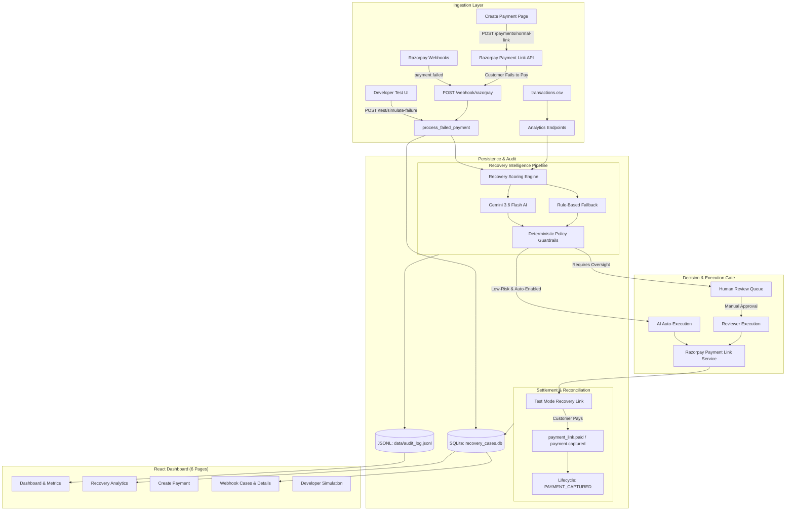

# RazorRecover AI

> **Agentic AI-Powered Revenue Recovery for Razorpay**  
> *AI recommends · Policy controls · Reviewer authorizes · Razorpay confirms*

RazorRecover AI detects failed payments in real-time, calculates recovery opportunity scores, uses Google Gemini AI to recommend optimal recovery actions, enforces deterministic safety policy guardrails, supports both human-in-the-loop review and bounded low-risk auto-recovery, and tracks recovered revenue end-to-end with an append-only audit trail.

---

## 🌟 Key Capabilities

- **Automated Webhook Ingestion**: Receives Razorpay `payment.failed`, `payment.captured`, and `payment_link.paid` webhooks with HMAC-SHA256 signature verification and idempotency checks.
- **Intelligent Recovery Scoring**: Evaluates customer payment history, failure reasons, transaction amount, and attempt counts to assign a 0–100 recovery score.
- **AI Recommendation Engine**: Powered by **Google Gemini (`gemini-3.6-flash`)** via the Google GenAI SDK to determine the highest-probability recovery action with confidence scores and risk flags.
- **Deterministic Policy Guardrails**: Independent policy engine enforces strict business rules (`ALLOW`, `REVIEW`, `DENY`) preventing unintended automated operations or excessive charges.
- **Flexible Execution Modes**:
  - **Human-in-the-Loop Review**: Reviewers inspect cases in the React dashboard, approving or rejecting recovery actions.
  - **AI Auto-Approval Guardrail**: Safely auto-executes recovery for low-risk, transient failures (`<= ₹1,000`, 1st attempt, confidence `>= 90%`) when `ENABLE_AUTO_RECOVERY=true`.
- **Normal Payment Link Creation**: Dashboard supports creating initial Razorpay Test Mode payment links to generate real `payment.failed` webhooks for end-to-end testing.
- **Payment Reconciliation**: Reconciles recovered payments through webhooks or on-demand status synchronization against the Razorpay API.
- **Comprehensive Audit Trail**: Append-only JSONL logging of every transaction analysis, policy evaluation, reviewer decision, and link execution.

---

## 📐 System Architecture



---

## 🛡️ Safety & Policy Model

| Layer | Responsibility | Safety Control |
|---|---|---|
| **AI Recommendation** | Advisory action selection (`gemini-3.6-flash`) | Never directly executes; assigns confidence & risk flags |
| **Deterministic Policy** | Mathematical guardrails (`ALLOW`, `REVIEW`, `DENY`) | Tiered routing, fraud blocks, attempt limits |
| **Review Queue** | Human-in-the-loop authorization | Non-auto cases require explicit reviewer token & sign-off |
| **Razorpay Executor** | Bounded link generation | **Test Mode only** (`rzp_test_*`), no unprompted notifications |
| **Audit Service** | Tamper-evident logging | Append-only `audit_log.jsonl` tracking every state change |

### 📊 Tiered Recovery Policy

| Amount Tier | Policy Decision | Case Status | Execution Mechanism |
|---|---|---|---|
| **$\le$ ₹1,000** | `ALLOW` | **`APPROVED` / `LINK_CREATED`** | Zero-touch AI auto-recovery (if `ENABLE_AUTO_RECOVERY=true`) |
| **₹1,001 – ₹25,000** | `ALLOW` / `REVIEW` | **`PENDING_REVIEW`** | Standard 1-click human review & authorization in dashboard |
| **$>$ ₹25,000** | `REVIEW` | **`PENDING_REVIEW`** | High-value VIP triage queue (badged **`HIGH VALUE`** in UI) |
| **Fraud / Spam ($\ge 3$)** | `DENY` | **`POLICY_BLOCKED`** | Blocked automatically (zero fraud liability) |

### ⚡ AI Auto-Approval Guardrail Criteria
When `ENABLE_AUTO_RECOVERY=true`, a case can bypass human review **only if ALL 9 criteria are satisfied**:

1. **AI Source**: Recommendation must be from Gemini AI (`source: "ai"`, fallbacks cannot auto-approve).
2. **Policy Approval**: Policy engine decision must be `ALLOW`.
3. **Action Type**: Must be `CREATE_PAYMENT_LINK` (no auto-retries).
4. **Payment Status**: Must be currently `failed`.
5. **First Attempt Only**: `previous_recovery_attempts == 0`.
6. **Amount Threshold**: Amount must be **`<= ₹1,000`** (`AI_AUTO_APPROVAL_LIMIT_RUPEES`).
7. **Transient Failure**: Reason must be one of: `bank_timeout`, `network_error`, `payment_failed`, `upi_failure`.
8. **High Confidence**: AI confidence score must be **`>= 0.90` (90%)**.
9. **Zero Risk Flags**: `risk_flags` list must be completely empty.

*If any criterion fails, the case safely defaults to `PENDING_REVIEW`.*

---

## 🚀 Quick Start

### 1. Prerequisites
- **Python 3.11+**
- **Node.js 18+**
- **Razorpay Test Mode** Account (Key ID + Secret)
- **Google Gemini API Key**

### 2. Backend Setup

```powershell
# Clone and enter directory
cd C:\revenue-rescue

# Create and activate virtual environment
python -m venv venv
.\venv\Scripts\activate

# Install dependencies
pip install -r backend\requirements.txt

# Configure environment variables
copy .env.example .env
```

Edit `.env` with your API credentials (see [Environment Variables](#-environment-variables)).

Start the FastAPI server:
```powershell
.\venv\Scripts\python.exe -m uvicorn backend.app.main:app --reload --port 8000
```
Backend API will be live at: **http://127.0.0.1:8000** (Docs: `http://127.0.0.1:8000/docs`)

### 3. Frontend Setup

```powershell
cd frontend
npm install
npm run dev
```
Dashboard will be live at: **http://localhost:5173** (or next available port like `5174`)

### 4. Webhook Setup (ngrok)

To receive live Razorpay webhooks in development, expose the backend via ngrok:

```powershell
ngrok http 8000
```

Copy the generated HTTPS URL (e.g. `https://xxxx.ngrok-free.app`) and configure it in your **Razorpay Dashboard → Webhooks**:
- **Webhook URL**: `https://xxxx.ngrok-free.app/webhook/razorpay`
- **Secret**: Must match `WEBHOOK_SECRET` in your `.env`
- **Active Events**: `payment.failed`, `payment.captured`, `payment_link.paid`

---

## ⚙️ Environment Variables

Configure these in your root `.env` file (copy from `.env.example`):

```env
# ── Razorpay Test Mode Credentials (Required) ─────────────────────────
RAZORPAY_KEY_ID=rzp_test_YOUR_KEY_ID
RAZORPAY_KEY_SECRET=YOUR_KEY_SECRET

# ── Webhook & Security ───────────────────────────────────────────────
WEBHOOK_SECRET=YOUR_WEBHOOK_SECRET
REVIEW_API_TOKEN=YOUR_STRONG_RANDOM_TOKEN

# ── Google Gemini AI (optional — falls back to rule-based if absent) ──
GEMINI_API_KEY=YOUR_GEMINI_API_KEY
# GEMINI_MODEL defaults to gemini-3.6-flash in code if not set

# ── Recovery Automation Flags ─────────────────────────────────────────
ENABLE_AUTO_RECOVERY=false            # Set true to enable AI auto-approval
ENABLE_DEVELOPER_SIMULATION=false     # Set true for POST /test/simulate-failure
EXECUTION_LIMIT_RUPEES=5000

# ── Storage ──────────────────────────────────────────────────────────
RECOVERY_DB_PATH=recovery_cases.db

# ── Customer Fallbacks for Recovery Links ────────────────────────────
DEFAULT_RECOVERY_CONTACT=+91XXXXXXXXXX
DEFAULT_RECOVERY_EMAIL=recovery@yourcompany.com
```

The frontend also needs its own environment variables in `frontend/.env` (copy from `frontend/.env.example`):

```env
# URL of the backend (leave as /api for the Vite dev proxy)
VITE_API_BASE_URL=/api

# Must match REVIEW_API_TOKEN in the root .env
VITE_REVIEW_API_TOKEN=YOUR_STRONG_RANDOM_TOKEN
```

> **Note:** The Vite dev server proxies `/api/*` requests to `http://127.0.0.1:8000` automatically via `vite.config.js`. You can alternatively set `VITE_API_BASE_URL=http://127.0.0.1:8000` in the root `.env` to bypass the proxy.

---

## 🔄 Case Lifecycle States

```text
payment.failed (Webhook / Simulation)
       │
       ├──[Policy Blocked]──────> POLICY_BLOCKED
       │
       ├──[Meets Auto-Approval]─> APPROVED ───> LINK_CREATED
       │                                             │
       └──[Standard Case]───────> PENDING_REVIEW     │ (Customer Pays)
                                       │             │
                                (Human Review)       ▼
                                       ▼      PAYMENT_CAPTURED (Recovered!)
                                APPROVED / REJECTED
```

| Lifecycle Status | Meaning |
|---|---|
| `PENDING_REVIEW` | Failed payment awaiting human reviewer decision in dashboard |
| `APPROVED` | Approved by human reviewer (or AI auto-approved) |
| `REJECTED` | Reviewer decided not to recover |
| `LINK_CREATED` | Razorpay Test Mode payment link generated and active |
| `PAYMENT_CAPTURED` | Customer successfully paid via recovery link (Revenue Recovered) |
| `POLICY_BLOCKED` | Blocked by deterministic safety rules (e.g. amount too high, fraud flag) |
| `EXECUTION_FAILED` | Error during Razorpay payment link creation |

---

## 🧪 Testing & Verification

Run the full automated test suite (48 unit and integration tests):

```powershell
.\venv\Scripts\python.exe -m pytest tests -v
```

### Test Coverage Summary
- **`tests/test_policy_execution.py`**: Validates policy engine guardrails, high-value blocks, attempt limits, confidence thresholds, and execution boundaries.
- **`tests/test_review_execute.py`**: Tests token authentication, human review approval/rejection flows, duplicate execution prevention, and AI auto-approval guardrails.
- **`tests/test_webhooks.py`**: Tests Razorpay HMAC signature verification, payload parsing, event deduplication, error normalization, and payment reconciliation.

---

## 📡 Key API Endpoints

### 🔓 Public Endpoints
- `GET /` & `GET /health` — Service health check
- `GET /recovery-cases` — Scored transaction cases from dataset
- `GET /revenue-at-risk` — Summary of revenue at risk

### 🔐 Reviewer Endpoints (`X-Review-Token` required)
- `GET /webhook-cases` — List all live recovery cases
- `POST /webhook-cases/{case_id}/review` — Submit human approval/rejection
- `POST /webhook-cases/{case_id}/execute` — Create recovery payment link
- `GET /webhook-cases/{case_id}/payment-link` — Fetch link URL and details
- `POST /webhook-cases/{case_id}/sync-payment` — Reconcile status directly from Razorpay
- `GET /recovery-metrics` — Real-time recovery rates, revenue recovered, and pipeline stats
- `GET /audit-trail` — Access append-only audit entries

### ⚡ Developer & Webhook Endpoints
- `POST /webhook/razorpay` — Razorpay HMAC-signed webhook endpoint
- `POST /test/simulate-failure` — Developer failure injection for end-to-end testing
- `POST /payments/normal-link` — Creates a test payment link to initiate initial transactions

---

## 📂 Project Structure

```
revenue-rescue/
├── backend/
│   ├── app/
│   │   ├── main.py                     # FastAPI application entry point & routing
│   │   ├── auth.py                     # Reviewer token authentication dependency
│   │   ├── constants.py                # Action vocabulary, thresholds & statuses
│   │   ├── routes/
│   │   │   └── razorpay.py             # Webhook, review, execute & simulation routes
│   │   └── services/
│   │       ├── ai_decision_service.py  # Gemini AI recommendation & fallback logic
│   │       ├── decision_service.py     # Rule-based recovery recommendations (fallback)
│   │       ├── policy_service.py       # Deterministic policy guardrails & auto-approval
│   │       ├── recovery_service.py     # 0-100 recovery scoring algorithm
│   │       ├── recovery_pipeline_service.py # End-to-end pipeline: score → recommend → policy
│   │       ├── razorpay_execution_service.py # Razorpay payment link client
│   │       ├── audit_service.py        # Append-only JSONL audit logger & metrics
│   │       ├── transaction_service.py  # Transaction filtering & data access
│   │       └── webhook_mapper.py       # Webhook payload normalization & error aliasing
│   └── requirements.txt                # Backend dependencies
│
├── frontend/
│   ├── index.html                      # SPA entry HTML
│   ├── src/
│   │   ├── main.jsx                    # React root mount with BrowserRouter
│   │   ├── App.jsx                     # All 6 pages: Dashboard, Analytics, Create,
│   │   │                               #   Webhook Cases, Case Details, Developer Test
│   │   ├── api.js                      # Authenticated backend API client
│   │   └── styles.css                  # Premium FinTech UI theme & styling
│   ├── .env.example                    # Frontend env template (VITE_* vars)
│   ├── package.json
│   └── vite.config.js                  # Vite dev server & /api proxy configuration
│
├── tests/
│   ├── conftest.py                     # Shared pytest fixtures & test client
│   ├── test_policy_execution.py        # Policy engine unit tests
│   ├── test_review_execute.py          # Workflow & auto-approval tests
│   └── test_webhooks.py                # Webhook & reconciliation tests
│
├── data/
│   ├── transactions.csv                # Sample dataset for analytics
│   └── audit_log.jsonl                 # Append-only JSONL recovery audit log
│
├── .env.example                        # Root env template (Razorpay, Gemini, security)
├── webhook_recovery.py                 # SQLite case database & lifecycle manager
├── create_payment_link.py              # Razorpay client helper functions
└── recovery_cases.db                   # SQLite database for live cases
```

---

## 🔒 Security & Compliance

1. **Test Mode Enforcement**: Hardcoded checks block live Razorpay keys (`rzp_live_*`).
2. **HMAC Webhook Verification**: Every Razorpay webhook payload is validated against `WEBHOOK_SECRET` before processing.
3. **Reviewer Token Protection**: All administrative, execution, and metrics endpoints require `X-Review-Token`.
4. **Idempotency Safeguards**: Event IDs and reference IDs prevent double execution or duplicate payment links.
5. **No Blind Customer Contact**: Automatic SMS/email notification flags are disabled by default for test safety.
