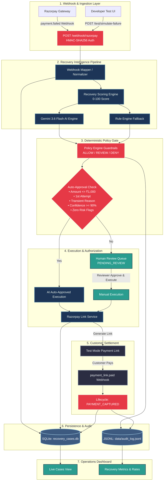
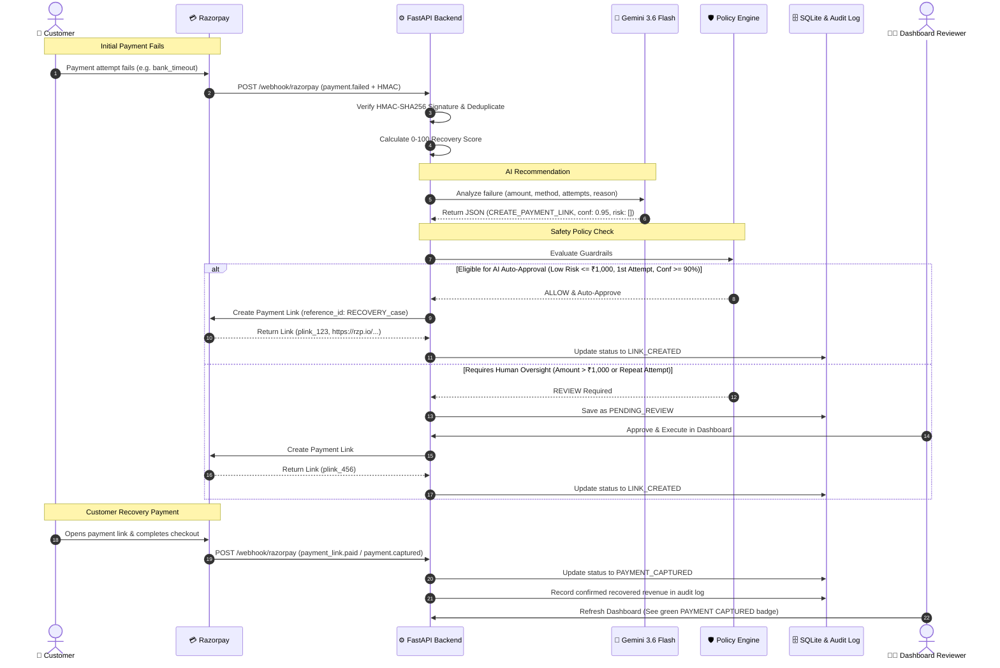

# RazorRecover AI — How It Works & Technical Architecture

> **A Comprehensive Guide to System Mechanics, Technology Decisions, Component Roles, and Workflows.**

---

## 1. What RazorRecover AI Actually Does

### The Problem
When customers attempt payments online (UPI, NetBanking, Cards), between **10% to 30% of transactions fail** due to temporary glitches (bank timeouts, network drops, insufficient account balance, or session expirations). Traditional payment gateways report these failures to merchants, but businesses often **lose the customer permanently** because:
1. Re-contacting customers manually is too slow.
2. Blindly retrying payments or spamming users damages customer trust.
3. High-risk transactions (e.g. potential fraud, repeat failures) require careful review, while low-risk transient glitches need instant automated recovery.

### The Solution
**RazorRecover AI** is an intelligent, policy-governed revenue recovery agent designed to bridge the gap between payment failure and successful recovery:

1. **Listens in Real-Time**: Intercepts Razorpay `payment.failed` webhooks the millisecond a transaction fails.
2. **Scores the Opportunity**: Evaluates customer history, error types, and amounts using a mathematical 0–100 recovery score.
3. **Applies Agentic AI Reasoning**: Uses **Google Gemini AI (`gemini-3.6-flash`)** to analyze the context and recommend the optimal recovery strategy (e.g. `CREATE_PAYMENT_LINK`, `SEND_REMINDER`, `HUMAN_REVIEW`).
4. **Enforces Hard Policy Guardrails**: A deterministic policy engine acts as a safety firewall (`ALLOW`, `REVIEW`, `DENY`), blocking excessive amounts or fraud risks.
5. **Executes Bounded Recovery**:
   - **AI Auto-Approval**: Bypasses human review for safe, low-risk transient failures (`<= ₹1,000`, 1st attempt, confidence `>= 90%`) to create an immediate recovery payment link.
   - **Human-in-the-Loop Review**: Places standard or higher-value cases into a dashboard queue for reviewer approval before executing.
6. **Reconciles Recovered Revenue**: Tracks when the customer pays the recovery link via `payment.captured` webhooks or on-demand status synchronization, logging the recovered revenue in an append-only audit trail.

---

## 2. Technology Stack & Why Each Was Chosen

```
┌────────────────────────────────────────────────────────────────────────┐
│                          TECH STACK AT A GLANCE                        │
├───────────────────┬───────────────────────────────┬────────────────────┤
│ Layer             │ Technology                    │ Primary Role       │
├───────────────────┼───────────────────────────────┼────────────────────┤
│ Backend API       │ FastAPI (Python 3.11+)        │ High-Speed Webhooks│
│ AI Intelligence   │ Google Gemini (3.6 Flash)     │ Contextual Recovery│
│ Payment Gateway   │ Razorpay Python SDK           │ Bounded Link Gen   │
│ Persistence       │ SQLite + Append-Only JSONL    │ State & Audit Log  │
│ Frontend UI       │ React + Vite + Lucide         │ Real-Time Ops SPA  │
│ Testing           │ Pytest                        │ 47 Guardrail Tests │
└───────────────────┴───────────────────────────────┴────────────────────┘
```

### 🐍 1. Backend: FastAPI & Python 3.11+
* **Why chosen?**
  * **Asynchronous & High-Throughput**: Handles incoming webhook bursts from Razorpay with non-blocking concurrency.
  * **Type Safety & Pydantic Validation**: Automatically validates incoming payloads, preventing corrupt or malformed payment structures.
  * **Native AI Ecosystem**: Seamless integration with Google GenAI SDK and data processing libraries.
* **Role**: Exposes secure API routes (`/webhook/razorpay`, `/webhook-cases`, `/recovery-metrics`), validates HMAC signatures, executes policy rules, and coordinates the pipeline.

### 🧠 2. AI Intelligence: Google Gemini (`gemini-3.6-flash`) via `google-genai` SDK
* **Why chosen?**
  * **Speed & Low Latency**: Flash architecture provides sub-second reasoning over transaction parameters.
  * **Structured JSON Enforcement**: Generates strictly validated JSON responses matching predefined Pydantic schemas (action, confidence, reason, risk flags).
  * **Contextual Nuance**: Differentiates between transient infrastructure errors (e.g. `bank_timeout`) and customer-side hard failures.
* **Role**: Evaluates the transaction context to recommend an action and assign a confidence score (0.0 to 1.0) and risk flags.

### 💳 3. Payment Gateway: Razorpay Python SDK (Test Mode)
* **Why chosen?**
  * **Industry Standard in India**: Deep support for UPI, Cards, NetBanking, and Payment Links.
  * **Idempotent Payment Links**: Allows generating unique recovery payment links bound to specific transaction reference IDs (`RECOVERY_<case_id>`).
* **Role**: Authenticates HMAC signatures on webhooks, creates Test Mode recovery payment links, and reconciles paid transaction statuses.

### 🗄️ 4. Persistence: SQLite + Append-Only JSONL Audit Log
* **Why chosen?**
  * **SQLite (`recovery_cases.db`)**: Zero-configuration, ACID-compliant relational store. Perfect for self-contained deployments and hackathons/buildathons.
  * **JSONL (`audit_log.jsonl`)**: Append-only log format ensures every AI decision, policy evaluation, and reviewer execution is immutably recorded for regulatory auditability.
* **Role**: Tracks case lifecycle states (`PENDING_REVIEW`, `APPROVED`, `LINK_CREATED`, `PAYMENT_CAPTURED`) and maintains an indelible event ledger.

### ⚛️ 5. Frontend: React + Vite + Lucide Icons
* **Why chosen?**
  * **Vite**: Ultra-fast hot module replacement (HMR) and optimized build pipeline.
  * **React SPA Architecture**: Instant state updates across views (Dashboard, Cases, Case Details, Developer Test) without full-page reloads.
  * **Clean Human-in-the-Loop UI**: Intuitive one-click approval, rejection, and manual status reconciliation.
* **Role**: Provides recovery operators and reviewers with live visibility into failed revenue, AI decisions, approval queues, and recovered metrics.

### 🧪 6. Testing: Pytest (47 Automated Tests)
* **Why chosen?**
  * **Fixture Isolation**: Isolated temporary SQLite databases and environment variables for clean test runs.
  * **Mocking Safety**: Mocks Razorpay and Gemini APIs so tests run in seconds without calling external networks or credentials.
* **Role**: Enforces policy boundaries, auto-approval thresholds, amount caps, and HMAC verification.

---

## 3. Diagrammatical Workflow & Component Architecture

### Architecture Flow Diagram



---

### Step-by-Step Sequence Flow



---

## 4. Case State Machine

```
   [Failed Payment]
          │
          ▼
   ┌───────────────┐
   │ Policy Check  │
   └───┬───────┬───┘
       │       │
 [Blocked]     [Eligible]
       │       │
       │       ├──[Auto-Approved]────────┐
       │       │                         │
       │       └──[Standard Case]        │
       │               │                 │
       │               ▼                 ▼
       │        PENDING_REVIEW        APPROVED
       │               │                 │
       │         (Human Review)          ▼
       │               │           LINK_CREATED
       ▼               ▼                 │
POLICY_BLOCKED     REJECTED              │ (Customer Pays)
                                         ▼
                                  PAYMENT_CAPTURED
                               (Revenue Recovered!)
```

---

## 5. Security & Safety Principles

1. **Tiered Execution**: AI auto-recovery is bounded to $\le$ ₹1,000; higher amounts require human authorization. Hard blocking is strictly reserved for fraud and max-retry spam.
2. **AI Never Overrides Policy**: The AI is purely advisory; if the policy engine says `DENY` or `REVIEW`, the AI cannot force auto-execution.
3. **HMAC Webhook Verification**: Every payload is authenticated using the shared `WEBHOOK_SECRET`.
4. **Token Authentication**: Administrative routes (`/webhook-cases`, `/test/simulate-failure`, metrics) require the `X-Review-Token` header.
5. **No Customer Spam**: Automatic SMS/email triggers are disabled by default (`notify_customer=false`) for Test Mode compliance.
